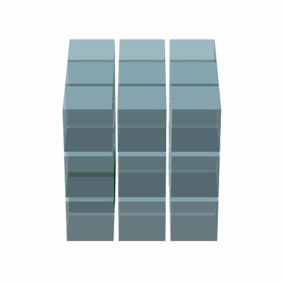

# RAC-Light-Grid-Architecture
Node based individual processing sets interconnected for parallel like travel
# RAC Light Grid Architecture 🧠💡

This project showcases a novel architecture for light-based processing using RACs (Recognition & Activation Cores). It demonstrates 3D traversal of memory nodes without relying on a central processor.

## 🚀 Highlights

- True **3D grid of RAC nodes** (visualized)
- Manual & diagonal traversal of a signal across a memory grid
- Proof of concept for **parallel, non-linear data flow**
- Visual demos as animated GIFs

## 📸 Visual Demo

### 🔁 Full 3D Grid Traversal

### 🎯 Close-up of Signal Behavior

## 🔧 Technologies

- Python
- Matplotlib
- Pygame (for interactive versions)
- ImageIO

## 📂 Files

- `rac_cube.py`: main visual simulation
- `rac_cube_traversal.gif`: general overview
- `rac_cube_traversal_front.gif`: up-close version

## 👤 Author

Anthony Grillone  
 research, development, and designer of this RAC processor system.

## 📄 License

MIT (or update as needed)
