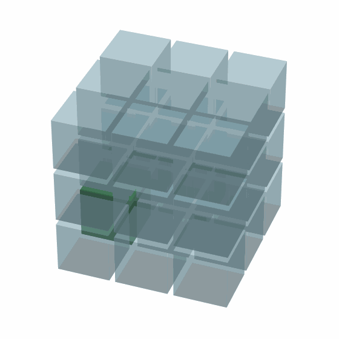

# RAC-Light-Grid-Architecture
Node based individual processing sets interconnected for parallel like travel
# RAC Light Grid Architecture 🧠💡

This project showcases a novel architecture for light-based processing using RACs (Recognition & Activation Cores). It demonstrates 3D traversal of memory nodes without relying on a central processor.

## 🚀 Highlights

- True **3D grid of RAC nodes** (visualized)
- Manual & diagonal traversal of a signal across a memory grid
- Proof of concept for **parallel, non-linear data flow**
- Visual demos as animated GIFs

## 📸 Visual Demo

### 🔁 Full 3D Grid Traversal

### 🎯 Close-up of Signal Behavior

## 🔧 Technologies

- Python
- Matplotlib
- Pygame (for interactive versions)
- ImageIO

## 📂 Files

- `rac_cube.py`: main visual simulation
- `rac_cube_traversal.gif`: general overview
- `rac_cube_traversal_front.gif`: up-close version

## 👤 Author

Anthony Grillone  
 research, development, and designer of this RAC processor system.

## 📄 License
MIT License

Copyright (c) 2025 goingplaces0318

Permission is hereby granted, free of charge, to any person obtaining a copy
of this software and associated documentation files (the "Software"), to deal
in the Software without restriction, including without limitation the rights
to use, copy, modify, merge, publish, distribute, sublicense, and/or sell
copies of the Software, and to permit persons to whom the Software is
furnished to do so, subject to the following conditions:

The above copyright notice and this permission notice shall be included in all
copies or substantial portions of the Software.

THE SOFTWARE IS PROVIDED "AS IS", WITHOUT WARRANTY OF ANY KIND, EXPRESS OR
IMPLIED, INCLUDING BUT NOT LIMITED TO THE WARRANTIES OF MERCHANTABILITY,
FITNESS FOR A PARTICULAR PURPOSE AND NONINFRINGEMENT. IN NO EVENT SHALL THE
AUTHORS OR COPYRIGHT HOLDERS BE LIABLE FOR ANY CLAIM, DAMAGES OR OTHER
LIABILITY, WHETHER IN AN ACTION OF CONTRACT, TORT OR OTHERWISE, ARISING FROM,
OUT OF OR IN CONNECTION WITH THE SOFTWARE OR THE USE OR OTHER DEALINGS IN THE
SOFTWARE.
